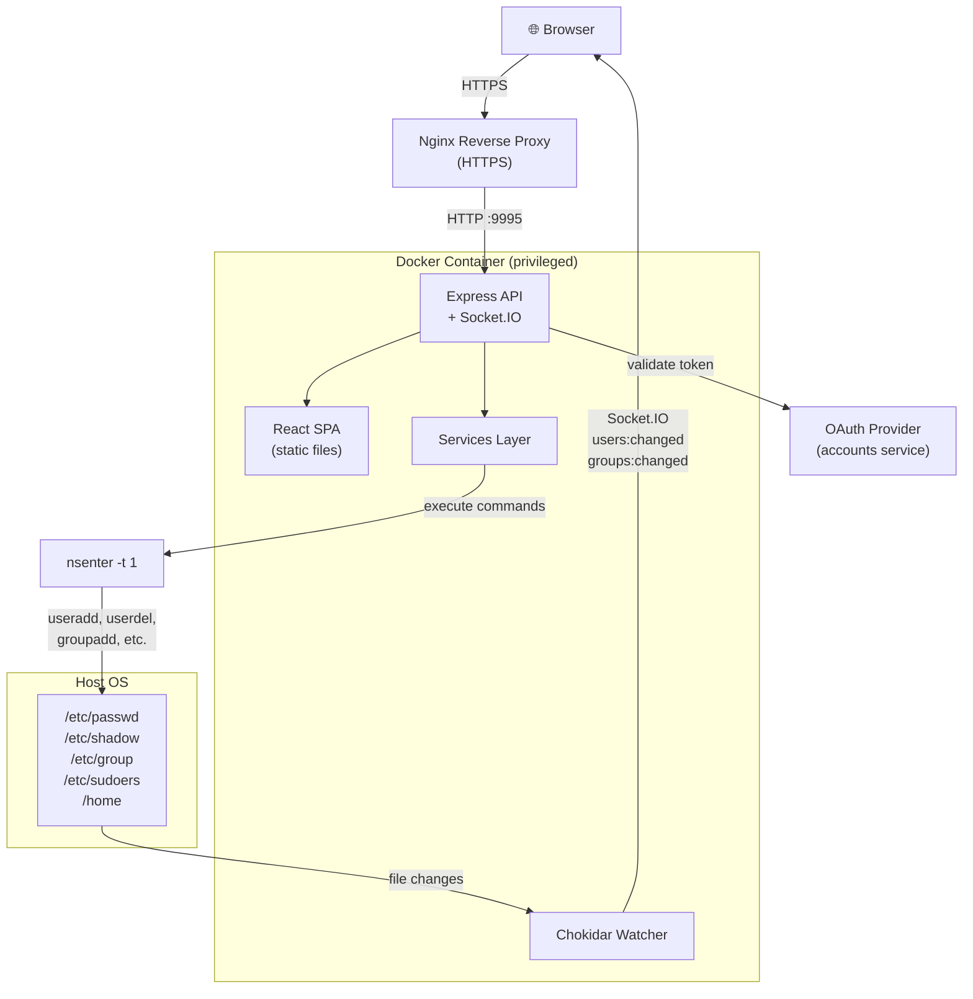
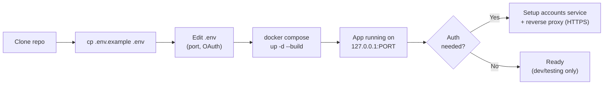

# SysAccounts

Web-based Linux server user management tool. Manage users, groups, sudoers, and sessions through a browser interface.

## Features

- **Users** — Create, delete, lock/unlock, change passwords, manage aging
- **Groups** — Create, delete, add/remove members
- **Sudoers** — Grant and revoke sudo rules (validated format only)
- **Sessions** — View active sessions, recent logins, kill sessions
- **Real-time** — Live updates via authenticated WebSocket when `/etc/passwd` or `/etc/group` changes
- **Auth** — OAuth 2.0 PKCE via [accounts](https://github.com/onchainyaotoshi/accounts), including WebSocket connections
- **Security** — Helmet headers, rate limiting, input validation on all endpoints

## Architecture



## Requirements

- Linux server (manages real system users)
- Docker and Docker Compose
- *(Optional)* [accounts](https://github.com/onchainyaotoshi/accounts) service for authentication

## Setup



### 1. Clone

```bash
git clone https://github.com/onchainyaotoshi/sysaccounts.git
cd sysaccounts
```

### 2. Configure

```bash
cp .env.example .env
```

Edit `.env`:

```bash
# Port — change to any port you want
PORT=9995

# Authentication (optional — skip these to run without auth)
ACCOUNTS_URL=https://your-accounts-server.com
OAUTH_CLIENT_ID=your-client-id
OAUTH_REDIRECT_URI=https://your-domain.com/auth/callback
OAUTH_POST_LOGOUT_REDIRECT_URI=https://your-domain.com
```

> If you skip the auth variables, the app runs without login — useful for testing, but **not recommended for production**.

### 3. Deploy

```bash
sudo docker compose up -d --build
```

The app is now running at `http://127.0.0.1:<PORT>` (where `<PORT>` is the value in your `.env`, default `9995`).

### 4. Access

The port binds to `127.0.0.1` only (not exposed to the network). To access remotely, put it behind a reverse proxy like Nginx:

```nginx
server {
    listen 443 ssl;
    server_name sysaccounts.your-domain.com;

    location / {
        proxy_pass http://127.0.0.1:<PORT>;
        proxy_set_header Host $host;
        proxy_set_header X-Real-IP $remote_addr;
        proxy_http_version 1.1;
        proxy_set_header Upgrade $http_upgrade;
        proxy_set_header Connection "upgrade";
    }
}
```

Replace `<PORT>` with your configured port. The `Upgrade`/`Connection` headers are needed for WebSocket (real-time updates).

## Updating

```bash
git pull
sudo docker compose up -d --build
```

## Environment Variables

| Variable | Default | Description |
|----------|---------|-------------|
| `PORT` | `9995` | Server port (Dockerfile, docker-compose, and app all respect this) |
| `ACCOUNTS_URL` | — | Auth server URL (if unset, auth is disabled) |
| `OAUTH_CLIENT_ID` | — | OAuth client ID |
| `OAUTH_REDIRECT_URI` | — | Callback URL after login |
| `OAUTH_POST_LOGOUT_REDIRECT_URI` | — | Redirect URL after logout (optional) |

## Security

- **Helmet** — Security headers (X-Content-Type-Options, X-Frame-Options, etc.) enabled by default
- **Rate limiting** — Global limit of 60 req/min on all API endpoints, 10 req/min on password changes
- **Input validation** — All route parameters and request bodies are validated (username, groupname, shell allowlist, home path, gecos, aging fields, password min 8 chars)
- **Sudoers rule validation** — Only standard sudo rule formats accepted (e.g. `ALL=(ALL) ALL`, `ALL=(ALL) NOPASSWD: /usr/bin/cmd`)
- **WebSocket auth** — Socket.IO connections require valid Bearer token when auth is enabled
- **Request body limit** — 100KB max on JSON payloads
- **Docker healthcheck** — Container monitors `/api/health` every 30s
- **Resource limits** — Container capped at 512MB memory and 1 CPU
- **Log rotation** — Container logs limited to 10MB x 3 files
- Container runs in **privileged mode** — required to manage system users via `nsenter`
- Port is bound to **127.0.0.1** — not directly accessible from the network
- Without auth configured, **anyone who can reach the port has full access** to user management
- Always use auth + reverse proxy with HTTPS in production

## License

MIT
