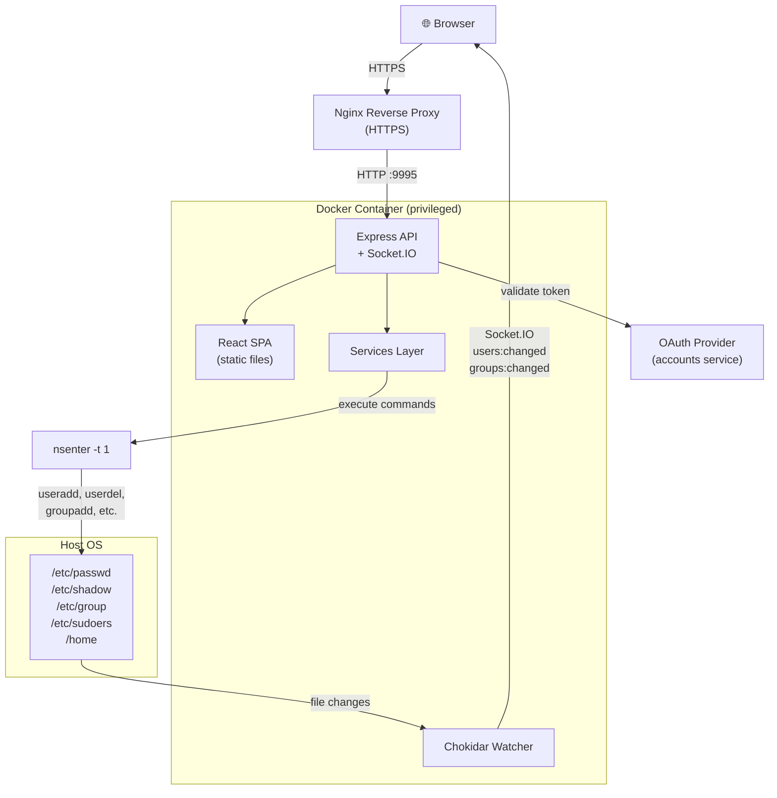
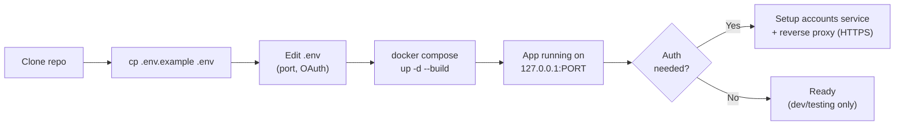
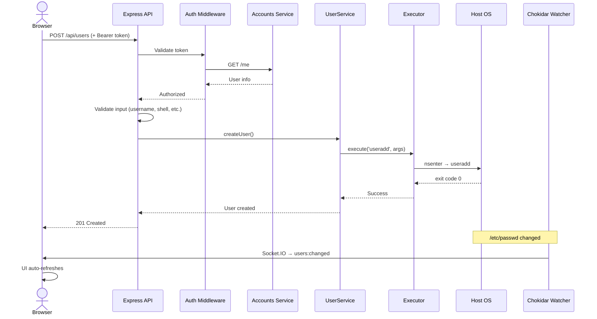
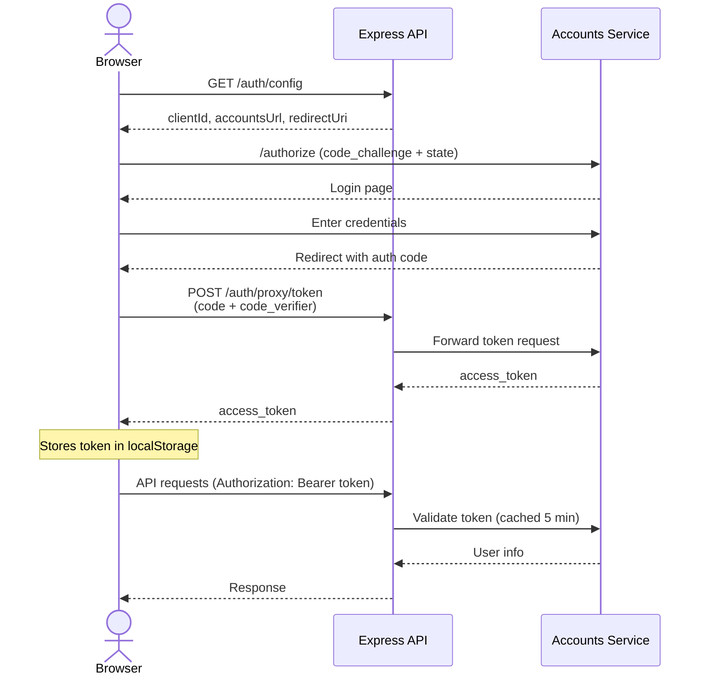

# README Mermaid Diagrams Implementation Plan

> **For agentic workers:** REQUIRED SUB-SKILL: Use superpowers:subagent-driven-development (recommended) or superpowers:executing-plans to implement this plan task-by-task. Steps use checkbox (`- [ ]`) syntax for tracking.

**Goal:** Add 4 Mermaid diagrams to README.md so first-time users can visually understand SysAccounts architecture and key flows.

**Architecture:** All changes are in a single file (`README.md`). Each task adds one diagram at a specific insertion point. No code changes, no tests — documentation only.

**Tech Stack:** Mermaid (GitHub-native rendering), Markdown

**Spec:** `docs/superpowers/specs/2026-03-22-readme-diagrams-design.md`

---

## File Map

- Modify: `README.md`
  - Insert "Architecture" section (diagram 1) between line 13 (end of Features) and line 15 (Requirements)
  - Insert deploy flow diagram (diagram 2) between line 21 (## Setup heading) and line 23 (### 1. Clone)
  - Insert "How It Works" section (diagram 3) between line 79 (end of Setup/Access) and line 81 (## Updating)
  - Insert "Auth Flow" section (diagram 4) after "How It Works", before "## Updating"

**Note:** Line numbers shift after each insertion. Tasks are ordered top-to-bottom in the file, so each task's insertion point is described relative to existing content anchors, not absolute line numbers.

---

### Task 1: Add Architecture Overview diagram

**Files:**
- Modify: `README.md` — insert new `## Architecture` section after `## Features` block (after line 13), before `## Requirements` (line 15)

- [ ] **Step 1: Add the Architecture section with Mermaid diagram**

Insert this block between the Features and Requirements sections:

````markdown
## Architecture


````

- [ ] **Step 2: Verify Mermaid renders correctly**

Run: Preview the README on GitHub or use a local Mermaid renderer to check the diagram renders without syntax errors.

- [ ] **Step 3: Commit**

```bash
git add README.md
git commit -m "docs: add architecture overview diagram to README"
```

---

### Task 2: Add Deploy Flow diagram

**Files:**
- Modify: `README.md` — insert deploy flow diagram after `## Setup` heading, before `### 1. Clone`

- [ ] **Step 1: Add the deploy flow diagram**

Insert this block right after the `## Setup` line, before `### 1. Clone`:

````markdown


````

- [ ] **Step 2: Verify Mermaid renders correctly**

Run: Preview the README on GitHub or use a local Mermaid renderer.

- [ ] **Step 3: Commit**

```bash
git add README.md
git commit -m "docs: add deploy flow diagram to README"
```

---

### Task 3: Add How It Works diagram

**Files:**
- Modify: `README.md` — insert new `## How It Works` section after the Setup section (after the Nginx config block and its explanation), before `## Updating`

- [ ] **Step 1: Add the How It Works section with sequence diagram**

Insert this block after the last line of the Setup section ("Replace `<PORT>`...real-time updates)."), before `## Updating`:

````markdown
## How It Works

Example: creating a user from the browser.



All user management actions (create, delete, lock, password change, groups, sudoers) follow this same pattern: **Browser → API → Validation → Service → nsenter → Host OS → Real-time update**.
````

- [ ] **Step 2: Verify Mermaid renders correctly**

Run: Preview the README on GitHub or use a local Mermaid renderer.

- [ ] **Step 3: Commit**

```bash
git add README.md
git commit -m "docs: add user management flow diagram to README"
```

---

### Task 4: Add Auth Flow diagram

**Files:**
- Modify: `README.md` — insert new `## Auth Flow` section after `## How It Works`, before `## Updating`

- [ ] **Step 1: Add the Auth Flow section with sequence diagram**

Insert this block after the "How It Works" section, before `## Updating`:

````markdown
## Auth Flow

OAuth 2.0 PKCE flow when authentication is configured (`ACCOUNTS_URL` set in `.env`).



If `ACCOUNTS_URL` is not set, auth is skipped entirely — the app runs without login (dev mode).
````

- [ ] **Step 2: Verify Mermaid renders correctly**

Run: Preview the README on GitHub or use a local Mermaid renderer.

- [ ] **Step 3: Commit**

```bash
git add README.md
git commit -m "docs: add OAuth PKCE auth flow diagram to README"
```
